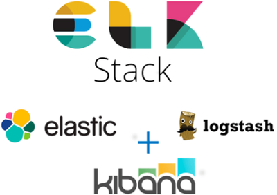

ansible-elk
===========

Description:
------------

In this projetcs we automate the installation of a ELK stack using ansible.
The stack components installed are:
- Elasticsearch
-  Logstash
-  Kibana

Requirements:
------------
* ansible version >= 2.9

Dependencies:
-------------

- **Java**

Role Variables:
---------------

[defaults vars path](vars/main.yml)

Usage
----------------

    - hosts: {{ playbook_hosts }}
      roles:
         - ansible-elk

Repository status
-----------------

Development in progress ...

Author
------
* Mansour KA - [email](kamansour06@gmail.com)

I hope this is useful for you. I'm open to hear feedbacks and suggestions for revisions.

Thanks and happy automating :) ...!